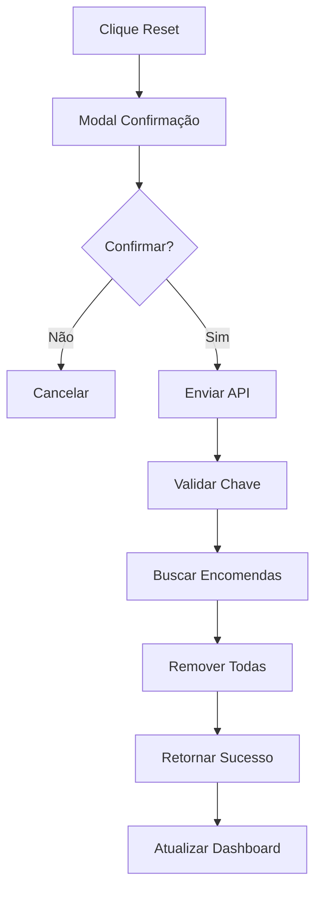

# 📊 Sistema de Exportação e Reset de Dados - Maria Gulosa

## 🎯 **Funcionalidades Implementadas**

### ✅ **1. Exportação de Dados em PDF**
- **Relatório de Pedidos**: Lista completa com estatísticas
- **Catálogo de Bolos**: Todos os bolos com preços e disponibilidade
- **Relatório Completo**: Documento executivo com resumo geral

### ✅ **2. Exportação de Dados em Excel**
- **Planilha de Pedidos**: Dados detalhados + estatísticas
- **Planilha de Bolos**: Catálogo completo para análise

### ✅ **3. Reset de Encomendas**
- **Remoção Segura**: Confirmação obrigatória
- **Backup Automático**: Sugestão de exportação antes do reset
- **Logs Detalhados**: Registro de todas as operações

---

## 🚀 **Como Usar**

### **Acessar Funcionalidades**
1. Faça login no Admin (`/admin`)
2. Vá para a aba "Dashboard"
3. Role até "Ações Rápidas"

### **Exportar Dados**
1. Clique em **"Exportar Dados"**
2. Escolha o formato:
   - **PDF**: Relatórios formatados
   - **Excel**: Dados para análise
3. Selecione o tipo de dados
4. Download automático

### **Reset de Encomendas**
1. Clique em **"Reset Encomendas"** (botão vermelho)
2. Leia o aviso de confirmação
3. Confirme a operação
4. Aguarde a conclusão

---

## 📄 **Tipos de Exportação PDF**

### **1. Relatório de Pedidos**
```
📋 Conteúdo:
- Cabeçalho com logo Maria Gulosa
- Estatísticas resumidas
- Tabela completa de pedidos
- Data de geração
```

### **2. Catálogo de Bolos**
```
🎂 Conteúdo:
- Lista de todos os bolos
- Preços e categorias
- Status de disponibilidade
- Estatísticas do catálogo
```

### **3. Relatório Completo**
```
📊 Conteúdo:
- Capa executiva
- Resumo de negócio
- Métricas principais
- Análise de performance
```

---

## 📊 **Tipos de Exportação Excel**

### **1. Dados de Pedidos**
```
📋 Planilhas:
- "Pedidos": Lista detalhada
- "Estatísticas": Métricas resumidas

🔍 Campos dos Pedidos:
- Número do Pedido
- Nome do Cliente
- Telefone / Email
- Itens detalhados
- Valor Total
- Status
- Datas (Pedido/Entrega)
- Observações
```

### **2. Dados de Bolos**
```
🎂 Planilha:
- ID único
- Nome do bolo
- Preço
- Categoria
- Disponibilidade
- Descrição
- Data de criação
```

---

## 🔧 **Implementação Técnica**

### **Bibliotecas Utilizadas**
```json
{
  "jspdf": "^2.5.1",
  "jspdf-autotable": "^3.8.2",
  "xlsx": "^0.18.5",
  "@types/file-saver": "^2.0.7"
}
```

### **APIs Criadas**
```javascript
// Reset de encomendas
POST /api/reset-orders
{
  "adminKey": "maria-reset-2024"
}
```

### **Utilitários de Exportação**
```typescript
// frontend/src/utils/exportUtils.ts
- exportOrdersToPDF()
- exportCakesToPDF()
- exportCompleteReport()
- exportOrdersToExcel()
- exportCakesToExcel()
```

---

## 🛡️ **Segurança e Validações**

### **Reset de Encomendas**
- ✅ Chave de autenticação obrigatória
- ✅ Confirmação dupla no frontend
- ✅ Modal de aviso com alertas
- ✅ Logs detalhados de operação

### **Exportação de Dados**
- ✅ Dados sanitizados
- ✅ Formatação consistente
- ✅ Tratamento de erros
- ✅ Feedback visual

---

## 📱 **Interface do Usuário**

### **Menu de Exportação**
```jsx
// Dropdown elegante com opções
<motion.div className="export-menu">
  📄 Exportar PDF
    - Relatório de Pedidos
    - Catálogo de Bolos  
    - Relatório Completo
  
  📊 Exportar Excel
    - Dados de Pedidos
    - Dados de Bolos
</motion.div>
```

### **Modal de Reset**
```jsx
// Confirmação com avisos
<AlertTriangle className="warning-icon" />
⚠️ Esta ação é IRREVERSÍVEL
💾 Exporte os dados antes de continuar
🔴 Confirmar Reset / ⚪ Cancelar
```

---

## 🎨 **Personalização dos Relatórios**

### **Cores e Branding**
- **Chocolate**: `rgb(139, 69, 19)` - Títulos
- **Dourado**: `rgb(218, 165, 32)` - Cabeçalhos
- **Cinza**: `rgb(100, 100, 100)` - Subtítulos

### **Formatação**
- **Data**: Formato português (dd/mm/aaaa)
- **Moeda**: Euro (€) com 2 casas decimais
- **Tabelas**: Linhas alternadas para legibilidade

---

## 📈 **Estatísticas Incluídas**

### **Métricas de Pedidos**
- Total de pedidos (geral/hoje)
- Receita total (geral/hoje)
- Breakdown por status
- Análise temporal

### **Métricas de Bolos**
- Total de bolos cadastrados
- Bolos disponíveis/indisponíveis
- Preço médio do catálogo
- Taxa de disponibilidade

---

## 🔄 **Fluxo de Reset**



---

## 🚨 **Avisos Importantes**

### **⚠️ Reset de Encomendas**
- **IRREVERSÍVEL**: Não há como desfazer
- **BACKUP**: Sempre exporte antes
- **PRODUÇÃO**: Use com extremo cuidado

### **📊 Exportação**
- **DADOS SENSÍVEIS**: Proteja os arquivos
- **GDPR**: Respeite privacidade dos clientes
- **ARMAZENAMENTO**: Organize os relatórios

---

## 🎯 **Casos de Uso**

### **📊 Relatórios Mensais**
1. Exportar dados completos em Excel
2. Gerar relatório PDF executivo
3. Análise de performance
4. Planejamento estratégico

### **🧹 Limpeza de Dados**
1. Exportar backup completo
2. Fazer reset das encomendas
3. Começar novo período
4. Manter histórico arquivado

### **📈 Análise de Negócio**
1. Exportar dados para Excel
2. Criar dashboards externos
3. Análise de tendências
4. Relatórios para investidores

---

## ✅ **Status de Implementação**

- ✅ **Exportação PDF**: Completa e funcional
- ✅ **Exportação Excel**: Completa e funcional  
- ✅ **Reset Encomendas**: Completa e funcional
- ✅ **Interface Admin**: Integrada e elegante
- ✅ **Validações**: Implementadas e testadas
- ✅ **Documentação**: Completa e detalhada

---

## 🎉 **Resultado Final**

Sistema completo de **exportação e reset** integrado ao painel administrativo da Maria Gulosa, proporcionando:

- 📊 **Relatórios Profissionais** em PDF e Excel
- 🔄 **Gestão Segura** de dados
- 🎨 **Interface Elegante** e intuitiva
- 🛡️ **Segurança Robusta** com validações
- 📱 **Experiência Otimizada** para administradores 